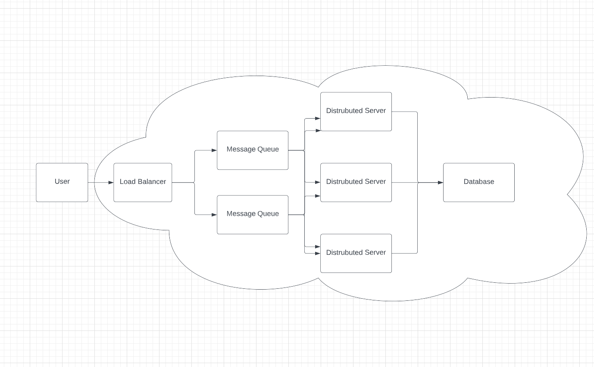
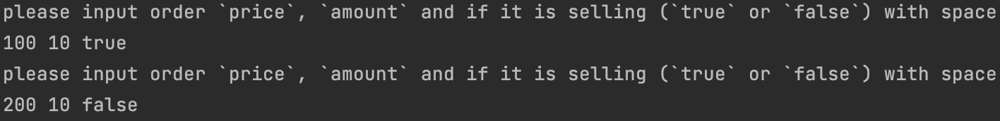
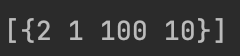

# MatchingEngine

## Introduction
This is a basic DEMO for a matching engine. 
The baseline of it is to make sure 
match buyer order and seller order together with 
matting price or correspondingly appropriate price.

## Language
Golang as the main language. Version Number `1.18`. No additional module needed.

## Basic Architecture
Usually, the whole system includes several distributed systems
with message queue as communication channel. the following gram
is what a basic trading engine architecture would look like.

## Coding Structure

There are several basic structs which defined in the `engine` directory.
`book`, `order`, `trade`.

* `book` is used to define the whole trading processes.
* `trade` is defined as the processes of the order matching and correspond methods.
* `order` is used to define the basic of each order.

The whole process is like this:
1. Initialize `Book` element
2. Wait for input with `price`, `amount` and `isSelling` (bool)

3. Initialize `order` according to the input
4. Check if there is a matching order in the waiting list
5. Match the order and create `trade` element as output with `TradeId`, `OrderId`, `Price`, `Amount`

## Further Optimization 

As for Thread safe, I think the most proper way to do so is adding
message queue before entering this system. `chan` could also implement 
the same result, but I have several reasons for that.

### The bottleneck of a sever
As a matching system, the most important part is
the reliability of the system and this matching engine is also the most important part
of the whole system. Therefore, we need to reduce the input data flow as small as possible at
one time. `chan` could help, but it will cost too much on the CPU or memory resources of the server.
Therefore, I believe it is better to add a message queue as a data input of the engine and add a sorting
system before the message queue would significantly reduce the pressure of the  matching server.

### Coupling between modules
Reducing the coupling between modules would significantly reduce the possibilities of accident occurring
during the development and deployment of each module.

### Better for debugging
It is also better for debugging.

### Distributed lock may do the same staff

## Testing 
You can uncomment the `Test` method in the main method for testing 